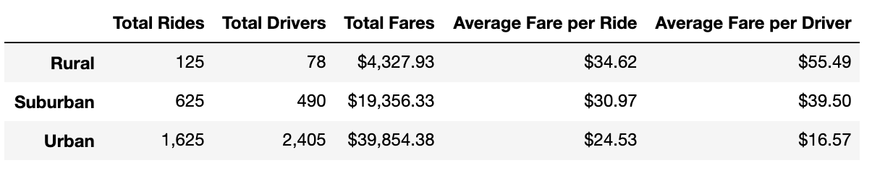
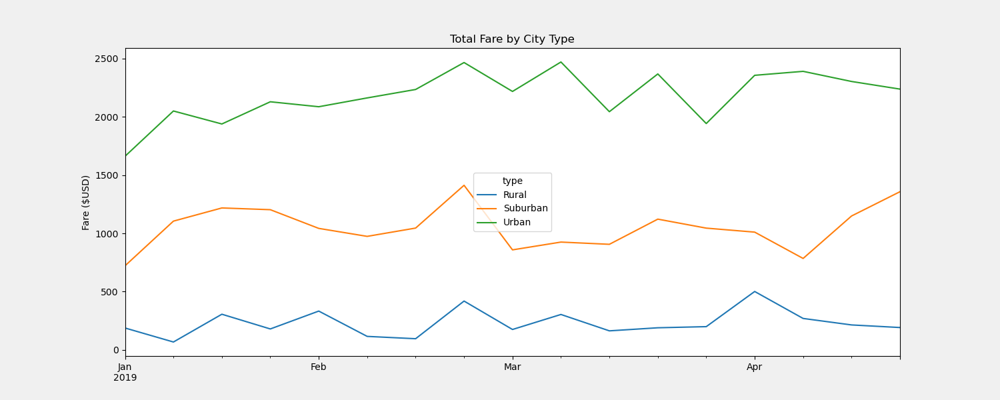

# PyBer Analysis
## Overview of Analysis
Pandas is a library for Python that can be used to analyze data.  Using Python and Pandas, we are able to create a summary DataFrame of ride-sharing data by city type for PyBer, a ride sharing company.  We can also create multiple-line graph and show the total weekly fares for each city type using Pandas and Matplotlib. 
## Results

The following dataframe was created to summarize dataframe metrics such as total rides, total drivers, total fares, average fare per ride and driver for each type of city:

Urban cities had the most total rides and drivers while rural cities had the least total rides and drivers out of all the different city types. In addition, urban cities brought in the highest revenue from total fares while rural cities brought in the least. Urban cities also had the least average fare per ride at $24.53 with an average fare of $16.57 per driver.  On the other hand, rural drivers had the highest average fare per ride at $34.62 with an average fare was $55.49 per driver.

The following multiple line graph shows the total fares by each city type from January 1, 2019 to April 29, 2019.

From this graph, we can see that urban cities had the highest total fare while rural cities had the lowest during this time period.  It is also noted that the third week of February had one of the highest total fares for all three types of cities.  By the end of February, it appears that the total fares for rural and suburban cities have increased since the beginning of the year.  However, the total fare for rural cities at the end of April is about the same it was in January.

## Summary
Based on this analysis, the following suggestions can address any disparities among the city types:
- Urban cities had the most amount of rides and highest total fare.  It would be good to continue to invest in these types of cities because it brings in the most revenue for PyBer.
- Although rural cities had the least amount of rides and lowest total fare, it did have the highest average fare per ride.  Increasing rides can still be profitable due to the high average fare per ride.  Perhaps advertisement can increase the number of rides.
- Suburban cities performed in the middle compared to urban and rural cities.  It would be more favorable to invest in urban cities and advertise in rural cities since suburban cities are doing decently.
